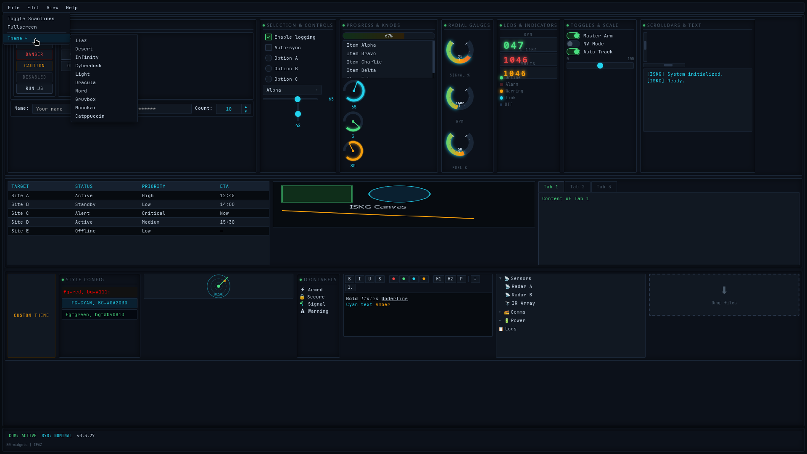

<div align="center">
  
  <h1>ISKG</h1>
  <p><b>IFAZ Widget Toolkit</b> — Python GUI framework ligero</p>

  [](https://github.com/Iskander-mlander/ISKG/actions)
  [](https://www.python.org)
  [](LICENSE)
  [](https://github.com/Iskander-mlander/ISKG/releases)
  [](#)
</div>

---

**ISKG** renders native-looking widgets as HTML/CSS/JS inside a native window via [pywebview](https://github.com/r0x0r/pywebview). 

No browser, no HTTP server — just a Python process and a lightweight WebView.

## Features

- **50 widgets**: Button, Entry, ComboBox, Slider, ProgressBar, Canvas, TreeView, DataGrid, Knob, Gauge, Notebook, MenuBar, and more.
- **Layout engines**: `pack`, `grid` (with sticky + weights), `place`.
- **Theming**: 10 built-in themes (ifaz, desert, infinity, cyberdusk, light, dracula, nord, gruvbox, monokai, catppuccin), CSS variable system.
- **Cross-platform**: Linux, Windows, macOS (same codebase).
- **Zero HTTP**: No server, no ports, no browser tabs — just a window.
- **JS bridge**: Bidirectional Python ↔ JavaScript calls for real-time UI updates.
- **`.tooltip` on every widget**: Set a tooltip via property or `config()`.
- **`after()` timers**: Cancelable timer objects with `.cancel()` and `.running`.
- **Debug mode**: Pass `debug=True` to `Application()` to log JS errors to stderr.
- **7 embedded fonts** (SIL OFL): [Inter](https://rsms.me/inter/), [JetBrains Mono](https://www.jetbrains.com/lp/mono/), [Nunito](https://fonts.google.com/specimen/Nunito), [Manrope](https://manropefont.com/), [Space Grotesk](https://fonts.google.com/specimen/Space+Grotesk), [Fira Sans](https://fonts.google.com/specimen/Fira+Sans), [Playfair Display](https://fonts.google.com/specimen/Playfair+Display) — no CDN, todo embebido.

## Quick start

```bash
# desde PyPI
pip install iskg

# from GitHub Releases
pip install https://github.com/Iskander-mlander/ISKG/releases/download/v0.3.67/iskg-0.3.67-py3-none-any.whl
```

```python
from iskg import (
    Application, Button, Label, Frame, Knob, LEDDisplay,
    Slider, ComboBox, ToggleSwitch, Separator, IndicatorLED,
)

app = Application(title="ISKG Dashboard", width=680, height=480)

counter = 0

def on_knob(data):
    led.value = int(float(data))

def on_slider():
    throttle_led.value = int(slider.value)
    ind_led.active = slider.value > 50

def on_arm():
    global counter; counter += 1
    status.config(text=f"Armed x{counter}")

def on_disarm():
    status.config(text="Standing By")

def on_theme(data=None):
    app.set_theme(combo.value)

root = Frame()
root.grid_columnconfigure(0, weight=1)
root.grid_columnconfigure(1, weight=1)

Label(parent=root, text="ISKG DASHBOARD", anchor="center",
      font="bold 16px").grid(row=0, column=0, columnspan=2, pady=8)

# left — Knob + LED
left = Frame(parent=root)
left.grid(row=1, column=0, sticky="nsew", padx=10, pady=6)
Label(parent=left, text="RPM CONTROL", anchor="center",
      font="bold 12px").grid(pady=6)
knob = Knob(parent=left, from_=0, to=3000, value=0,
            size=90, color="cyan")
knob.bind("change", on_knob)
knob.grid(sticky="c", pady=4)
led = LEDDisplay(parent=left, value=0, digits=4,
                 color="cyan", height=36)
led.grid(sticky="c", pady=6)

# right — Slider + LED display
right = Frame(parent=root)
right.grid(row=1, column=1, sticky="nsew", padx=10, pady=6)
Label(parent=right, text="THROTTLE", anchor="center",
      font="bold 12px").grid(pady=6)
slider = Slider(parent=right, from_=0, to=100,
                value=0, command=on_slider)
slider.grid(sticky="we", pady=8)
throttle_led = LEDDisplay(parent=right, value=0, digits=3,
                          color="amber", height=36)
throttle_led.grid(sticky="c", pady=4)
ind_led = IndicatorLED(parent=right, color="red")
ind_led.grid(sticky="c", pady=2)

# bottom bar
bottom = Frame(parent=root)
bottom.grid(row=2, column=0, columnspan=2, sticky="we", padx=10, pady=6)
Button(parent=bottom, text="ARM", command=on_arm).grid(padx=4)
Button(parent=bottom, text="DISARM", command=on_disarm).grid(padx=4)
Label(parent=bottom, text="Theme:").grid(padx=(12, 2))
combo = ComboBox(parent=bottom,
    values=["ifaz", "desert", "infinity", "cyberdusk", "light", "dracula", "nord", "gruvbox", "monokai", "catppuccin"],
    command=on_theme).grid(padx=4)
ToggleSwitch(parent=bottom).grid(padx=4)
status = Label(parent=bottom, text="Standing By")
status.grid(padx=8)

app.add(root)
app.run()
```



## Documentation

Full API reference: [github-pages](https://iskander-mlander.github.io/ISKG/)

## License

GPLv3 — see [LICENSE](LICENSE).
