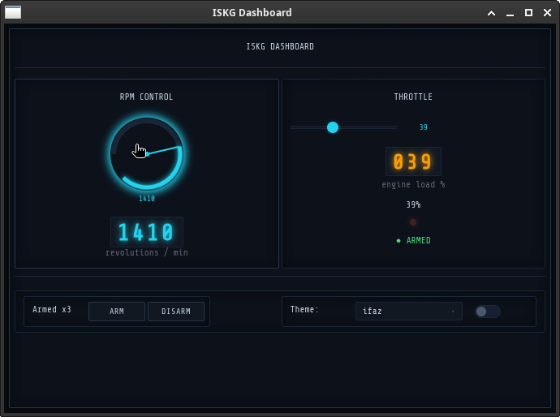

<div align="center">
  
  <h1>ISKG</h1>
  <p><b>IFAZ Widget Toolkit</b> — Python GUI framework with a tactical/IFAZ theme</p>

  [](https://github.com/Iskander-mlander/ISKG/actions)
  [](https://www.python.org)
  [](LICENSE)
  [](https://pypi.org/project/iskg/)
  [](#)
</div>

---

**ISKG** renders native-looking widgets as HTML/CSS/JS inside a native window via [pywebview](https://github.com/r0x0r/pywebview). No browser, no HTTP server — just a Python process and a lightweight WebView.

## Features

- **30+ widgets**: Button, Entry, ComboBox, Slider, ProgressBar, Canvas, TreeView, DataGrid, Knob, Gauge, Notebook, MenuBar, and more.
- **Layout engines**: `pack`, `grid` (with sticky + weights), `place`.
- **Theming**: 5 built-in themes (ifaz, amber, green, blue, light), CSS variable system.
- **Cross-platform**: Linux, Windows, macOS (same codebase).
- **Zero HTTP**: No server, no ports, no browser tabs — just a window.
- **JS bridge**: Bidirectional Python ↔ JavaScript calls for real-time UI updates.
- **`.tooltip` on every widget**: Set a tooltip via property or `config()`.
- **`after()` timers**: Cancelable timer objects with `.cancel()` and `.running`.
- **Sphinx docs**: Full API reference [available](docs/_build/html/).

## Comparison — lightness & footprint

| Framework | Dependencies | Installed size | Own code | Notes |
|-----------|-------------|----------------|----------|-------|
| **Tkinter** | 0 (stdlib) | ~1 MB | — | No modern widgets, dated look |
| **Remi** | 1 (bottle/werkzeug) | ~2 MB | ~15 KLoC | Browser-based, needs a tab |
| **ISKG** | 3 (pywebview, bottle, proxy_tools) | ~2 MB | ~6 KLoC | Native window, modern widgets |
| **PySimpleGUI** | 1 (tkinter/Qt) | ~5 MB | ~100 KLoC | Wrapper, not a framework |
| **Dear PyGui** | 0 (bundled) | ~10 MB | ~80 KLoC | GPU-accelerated, no native look |
| **Kivy** | SDL2, GLEW, etc | ~15 MB | ~200 KLoC | Own UI language, heavy |
| **wxPython** | wxWidgets | ~20 MB | ~150 KLoC | Native look, complex build |
| **PyQt/PySide** | Qt (~100 MB) | ~50 MB | ~500 KLoC | Full-featured, huge size |
| **NiceGUI** | FastAPI + uvicorn + Vue | ~30 MB | ~50 KLoC | Browser-based, async |
| **Flet** | Flutter SDK | ~200 MB | — | Requires Flutter toolchain |

**ISKG ranks 3rd** in lightness — only Tkinter and Remi are smaller. Among frameworks that render in a **native window** (not a browser tab), ISKG is the **lightest after Tkinter**.

## Quick start

```bash
pip install iskg
```

```python
from iskg import (
    Application, Button, Label, Frame, Knob, LEDDisplay,
    Slider, ComboBox, ToggleSwitch, Separator, IndicatorLED,
)

app = Application(title="ISKG Dashboard", width=680, height=480)

counter = 0

def on_knob(data):
    led.value = int(float(data))

def on_slider():
    throttle_led.value = int(slider.value)
    ind_led.active = slider.value > 50

def on_arm():
    global counter; counter += 1
    status.config(text=f"Armed x{counter}")

def on_disarm():
    status.config(text="Standing By")

def on_theme(data=None):
    app.set_theme(combo.value)

root = Frame()
root.grid_columnconfigure(0, weight=1)
root.grid_columnconfigure(1, weight=1)

Label(parent=root, text="ISKG DASHBOARD", anchor="center",
      font="bold 16px").grid(row=0, column=0, columnspan=2, pady=8)

# left — Knob + LED
left = Frame(parent=root)
left.grid(row=1, column=0, sticky="nsew", padx=10, pady=6)
Label(parent=left, text="RPM CONTROL", anchor="center",
      font="bold 12px").grid(pady=6)
knob = Knob(parent=left, from_=0, to=3000, value=0,
            size=90, color="cyan")
knob.bind("change", on_knob)
knob.grid(sticky="c", pady=4)
led = LEDDisplay(parent=left, value=0, digits=4,
                 color="cyan", height=36)
led.grid(sticky="c", pady=6)

# right — Slider + LED display
right = Frame(parent=root)
right.grid(row=1, column=1, sticky="nsew", padx=10, pady=6)
Label(parent=right, text="THROTTLE", anchor="center",
      font="bold 12px").grid(pady=6)
slider = Slider(parent=right, from_=0, to=100,
                value=0, command=on_slider)
slider.grid(sticky="we", pady=8)
throttle_led = LEDDisplay(parent=right, value=0, digits=3,
                          color="amber", height=36)
throttle_led.grid(sticky="c", pady=4)
ind_led = IndicatorLED(parent=right, color="red")
ind_led.grid(sticky="c", pady=2)

# bottom bar
bottom = Frame(parent=root)
bottom.grid(row=2, column=0, columnspan=2, sticky="we", padx=10, pady=6)
Button(parent=bottom, text="ARM", command=on_arm).grid(padx=4)
Button(parent=bottom, text="DISARM", command=on_disarm).grid(padx=4)
Label(parent=bottom, text="Theme:").grid(padx=(12, 2))
combo = ComboBox(parent=bottom,
    values=["ifaz", "cold", "warm", "night"],
    command=on_theme).grid(padx=4)
ToggleSwitch(parent=bottom).grid(padx=4)
status = Label(parent=bottom, text="Standing By")
status.grid(padx=8)

app.add(root)
app.run()
```



## Documentation

Full API reference: [github-pages](https://iskander-mlander.github.io/ISKG/) _(requires GitHub Pages enabled in repo settings → `gh-pages` branch)_

## License

GPLv3 — see [LICENSE](LICENSE).
