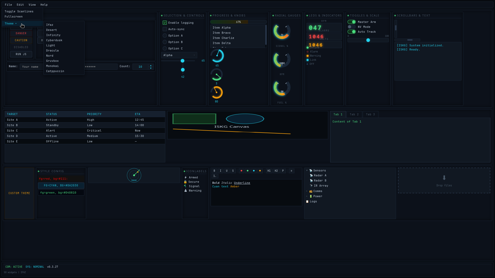

<div align="center">
  
  <h1>ISKG</h1>
  <p><b>IFAZ Widget Toolkit</b> — Python GUI framework ligero</p>

  [](https://github.com/Iskander-mlander/ISKG/actions)
  [](https://www.python.org)
  [](LICENSE)
  [](https://github.com/Iskander-mlander/ISKG/releases)
  [](#)
</div>

---

**ISKG** renders native-looking widgets as HTML/CSS/JS inside a native window via [pywebview](https://github.com/r0x0r/pywebview). 

No browser, no HTTP server — just a Python process and a lightweight WebView.

## Features

- **38 widgets**: Button, Entry, ComboBox, Slider, ProgressBar, Canvas, TreeView, DataGrid, Knob, Gauge, Notebook, MenuBar, and more.
- **Context menus**: right-click menus per widget via `set_menu()` / `popup_menu()` and `bind("contextmenu", cb)`, with submenus, separators, and shortcuts.
- **Layout engines**: `pack`, `grid` (with sticky + weights), `place`.
- **Theming**: 13 built-in themes (ifaz, desert, infinity, cyberdusk, night, warm, cold, light, dracula, nord, gruvbox, monokai, catppuccin), CSS variable system.
- **Cross-platform**: Linux, Windows, macOS (same codebase).
- **Zero HTTP**: No server, no ports, no browser tabs — just a window.
- **JS bridge**: Bidirectional Python ↔ JavaScript calls for real-time UI updates.
- **`.tooltip` on every widget**: Set a tooltip via property or `config()`.
- **`after()` timers**: Cancelable timer objects with `.cancel()` and `.running`.
- **Debug mode**: Pass `debug=True` to `Application()` to log JS errors to stderr.
- **7 embedded fonts** (SIL OFL): [Inter](https://rsms.me/inter/), [JetBrains Mono](https://www.jetbrains.com/lp/mono/), [Nunito](https://fonts.google.com/specimen/Nunito), [Manrope](https://manropefont.com/), [Space Grotesk](https://fonts.google.com/specimen/Space+Grotesk), [Fira Sans](https://fonts.google.com/specimen/Fira+Sans), [Playfair Display](https://fonts.google.com/specimen/Playfair+Display) — no CDN, todo embebido.

## Quick start

```bash
# desde PyPI
pip install iskg

# from GitHub Releases
pip install https://github.com/Iskander-mlander/ISKG/releases/download/v0.3.72/iskg-0.3.72-py3-none-any.whl
```

```python
from iskg import (
    Application, Button, Entry, Label, Frame,
    Slider, ComboBox, ProgressBar, ToggleSwitch,
)

app = Application(title="ISKG Quick Start", width=560, height=420)

# Root frame with a stretchable column 0
root = Frame(parent=None)
root.grid_columnconfigure(0, weight=1)

Label(parent=root, text="ISKG QUICK START", anchor="center",
      font="bold 16px").grid(row=0, column=0, columnspan=2, pady=(8, 4))

# Greet: Entry in column 0, Button in column 1
name = Entry(parent=root, text="world")
name.grid(row=1, column=0, sticky="we", padx=8)

greeting = Label(parent=root, text="Hello, world!")
greeting.grid(row=2, column=0, sticky="w", padx=8)

def on_greet():
    greeting.config(text=f"Hello, {name.text or 'world'}!")

Button(parent=root, text="Greet", command=on_greet).grid(row=1, column=1, padx=8)

# Slider drives the ProgressBar
slider = Slider(parent=root, from_=0, to=100, value=30)
slider.grid(row=3, column=0, sticky="we", padx=8)

progress = ProgressBar(parent=root, max_=100, value=30)
progress.grid(row=4, column=0, sticky="we", padx=8)

def on_slider_change(_data):
    progress.value = slider.value

slider.bind("change", on_slider_change)

# Theme picker + a toggle
combo = ComboBox(
    parent=root,
    values=["ifaz", "desert", "cyberdusk", "night", "warm", "cold", "light"],
    command=lambda _d: app.set_theme(combo.value),
)
combo.grid(row=5, column=0, sticky="we", padx=8)

ToggleSwitch(parent=root, text="Extra").grid(row=5, column=1, padx=8)

Label(parent=root, text="Ready", anchor="center").grid(
    row=6, column=0, columnspan=2, pady=8
)

app.add(root)
app.run()
```



## Documentation

Full API reference: [github-pages](https://iskander-mlander.github.io/ISKG/)

## License

GPLv3 — see [LICENSE](LICENSE).
